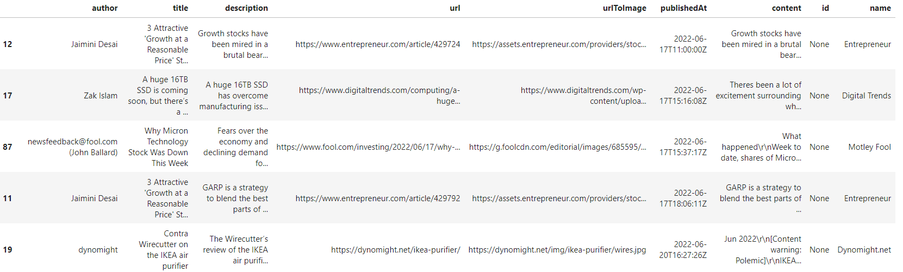
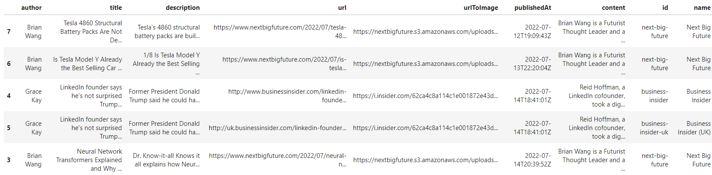
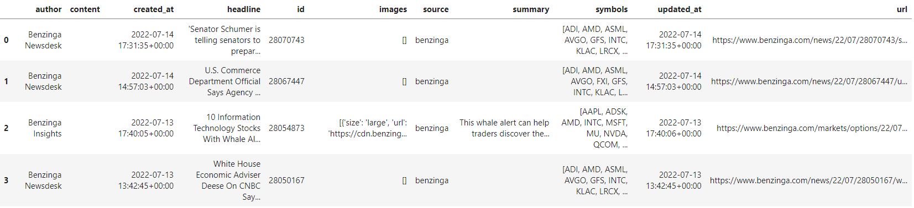
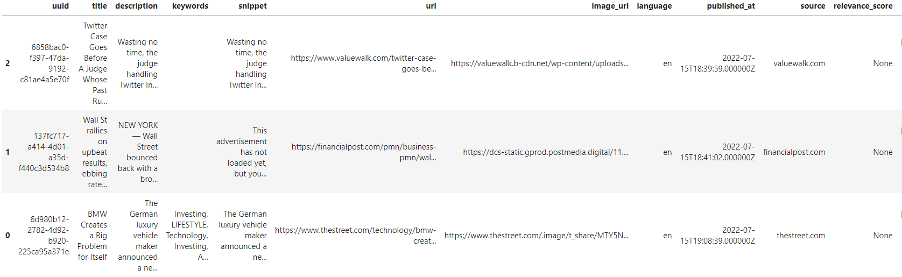
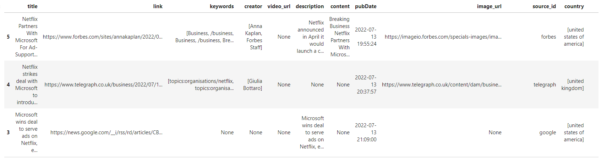

# NewsFeedsAPIs

# Python for Beginners - Get Started Using Free News APIs in Python that are Available in 2022

There are lots of APIs out there to help you get connected with the news! These Jupyter notebooks can help you get started with some of the APIs out there that are available to use for free. All of the APIs described below also have paid subscription tiers, so naturally you will be more limited from a data quantity perspective with the free version.

If you're new to python or navigating json() response objects that are used to pull data from APIs, that's alright! These notebooks are designed for beginners. 

As I discover additional news APIs with free plans I will be adding the documentation to this repo, so stay tuned!

# Table of contents
1. [Introduction](#Introduction)
    1. [Why Even Bother?](#Why_even_bother)
    2. [Purpose of the Notebooks](#Purpose_of_the_notebooks)
1. [Technologies](#Technologies)
2. [Installation Guide](#Installation_Guide)
3. [APIs](#APIs)
    1. [Google](#Google)
    2. [Alpaca](#Alpaca)
    3. [Marketaux](#Marketaux)
    4. [Newsdata.io](#Newsdata.io)
4. [Updates](#Updates)
    1. [July 15, 2022](#July_15_2022)

# Introduction 

## Why Even Bother? 

Personally, I am tired of getting sucked in to click-bait style articles with my innocent desire to stay up-to-date with the world. Maybe I’m just looking for garbage to being with, which is why I’m being fed garbage in return. At times it’s easy to ignore, but other times my initial quick search to figure out the state of the world takes me down rabbit holes and I’m suddenly more interested in what Kim Kardashian is wearing than the state of the economy. 

Using news APIs is a great way to see articles from a huge variety of different sources, and you can fine-tune the results based on your own preferences without search engines serving you ads and filtering the results with an algorithm. Using news APIs is also a great way to feed your data science projects as well!

## Purpose of the Notebooks 

APIs can take a while to connect to especially if you're not very experienced using APIs to pull data. It's a lot easier than scraping the web as well! The difficulty is navigating among all the free vs paid subscription plans. These notebooks are quick to get up and running on your computer and designed to extract the data pulled from the API into a pandas dataframe for easier use. 

# Technologies 

This program is written in Python (3.7.13) and developed using JupyterLabs notebooks using Windows. We are importing the os, requests, json (2.0.9), pandas (1.1.5), dotenv, and alpaca_trade_api (2.3.0) libraries (see parenthesis for versions used in program development).

# Installation Guide 

Clone the repository to your computer and check out the Jupyer notebooks! The notebooks are simple to use and with the code you can quickly get the data into a pandas dataframe. 

Storing your API keys directly in your notebooks isn't the greatest practice, you can easily store this information in a .env file for easy access. A few notebooks in this repo use this technique. 

If you haven't used Alpaca before, you'll definitely need to run `pip install alpaca_trade_api` to work with the library. You will need to install the other libraries listed above if you don't already have them installed.

# APIs 

## Google 

Each request returns information for up to 100 articles and you're limited to 100 requests per day. Their API pulls information as far back as one month ago with the free plan.

### "everything" news API 

You can specify additional information in the request parameters, such as: q (keywords or phrases), serachIn, sources, domains, excludeDomains, from, to, language, sortBy, pageSize (number of results to return per page), and page.

Here's an example of the dataframe that you can generate with the code:

### "top-headlines" API

You can specify additional information in the request parameters, such as: country, category, sources, q (keywords or phrases), pageSize (number of results to return per request), and page.

Here's an example of the dataframe that you can generate with the code:

For more information, check out their [pricing plans](https://newsapi.org/pricing) and [documentation](https://newsapi.org/docs/endpoints).

## Alpaca 

### News API

Back in February of this year, Alpaca announced on their [blog](https://alpaca.markets/blog/introducing-news-api-for-real-time-fiancial-news/) that they were partnering with Bezinga to offer an API for real-time stock and crypto news.

For the free plan, you're able to make 200 calls per minute with up to 10 articles returned per API call, and you can access data as far back as 2015.

Here's an example of the dataframe that you can generate with the code:

For more information, check out their [documentation](https://alpaca.markets/docs/market-data/news/).

## Marketaux 

### "Finance & Market News API"

This API returns finance & market news, where each request returns information for 3 articles and you're limited to 100 requests per day. Their API goes as far back as January 2021 as of the time of writing. 

You can specify additional information in the request parameters, such as: symbols, exchanges, entity_types, industries, countries, sentiment_gte, sentiment_lte, min_match_score, filter_entities, must_have_entities, group_similar, search, domains, exclude_domains, source_ids, exclude_source_ids, language, published_before, publisehd_after, published_on, sort, sort_order, limit, and page.

Here's an example of the dataframe that you can generate with the code:

For more information, check out their [pricing plans](https://www.marketaux.com/pricing) and [documentation](https://www.marketaux.com/documentation).

## Newsdata.io 

### "Get Latest News" API

This API returns the latest news data and stretches as far back as 2 days prior to the request. With the free plan, each request returns a maxium of 10 articles and you can make up to 200 requests per day.

You can specify additional information in the request parameters, such as: country, category, language, domain, from_date, to_date, q (keywords or phrases), qInTitle (keywords or phrases in title only), and page. 

Here's an example of the dataframe that you can generate with the code:

For more information, check out their [pricing plans](https://newsdata.io/pricing) and [API documentation](https://newsdata.io/docs).

# Updates 

## July 15 2022 

Initial creation of the repo, check back for updates!

